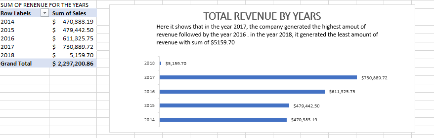
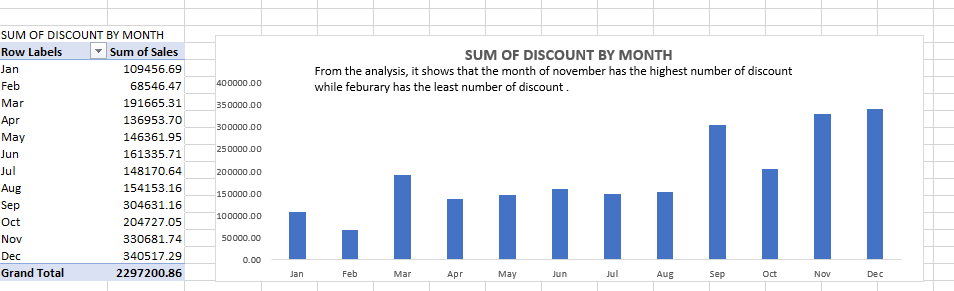
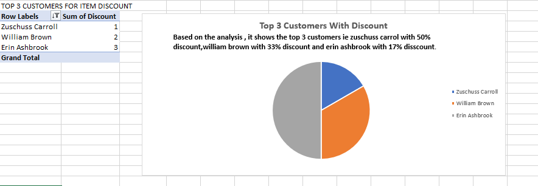
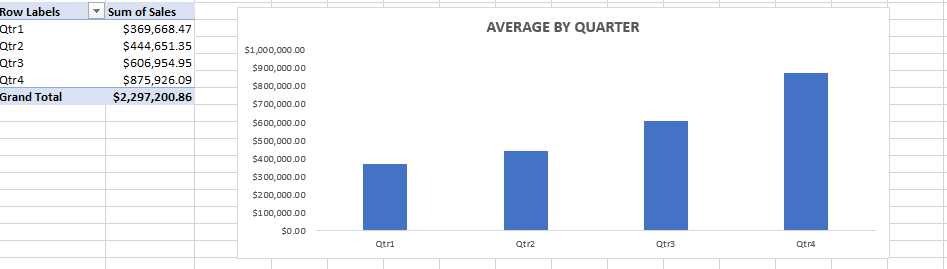
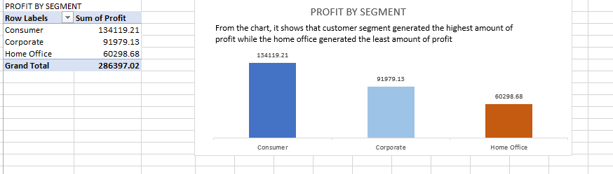
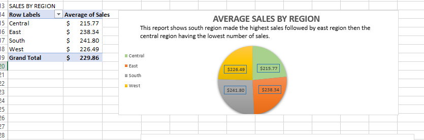

## MS-EXCEL-PROJ 
# The dataset is the U.S. superstore 
I started the analysis by importing the dataset into Excel.  I checked for missing values and blank cells in each column, and I also looked out for duplicated rows to ensure data integrity. 
The goal of this project is to keep track of the revenue across different segments, months , quarters, and months.
This will help us understand where the lapses came from and how to resolve them.

## Problem Statement 
1. Total revenue for the years 
2. Average sales by region
3. Average sales by quarters 
4. Sales by segment 
5. How do products sold vary by month?
6. Top 3 customers with highest discount

## Data visualization
1. column chart to represent the average sales by quarters 
2. line chart to represent the products sold by month
3. bar chart to represent total profit by segment 
4. column to represent discount by top 3 customers
5. pie chart to represent sales by region
6. A bar chart to represent total revenue for the years

## ANALYSIS
# CUSTOMER HISTORY
# 2297200.86 orders were made throughout the years
# The store has a total number of 4994 customer

## product catalog

They are 3 categories in the store with a value of $229.8580008.

## Transaction History

# The total selling price is $2297,200.86.
# The highest gross income was generated in DECEMBER
# There is an intermittent rise and fall in the gross income of the store by every month in the entire year

## Discount By Month

The month with highest discount was in DECEMBER followed by NOVEMBER.
This clearly explains why Qtr 4 made the highest sales because much discount was given in the month of DECEMBER

## TOP 3 CUSTOMERS BY DISCOUNT

# Zuschuss Carrol had the highest discount with 50%.
# William Brown had 33% discount while
# Erin Ashbrook had 17% discount.

## AVERAGE BY QUANTITY

# Total 
Qtr4 made the highest sales with $ 875,926.09 
Qtr3 with $ 606,954.95 
Qtr1 made the least amount of sales with $369,668.47 

## PROFIT BY SEGMENT

 

# Customers segment generated the highest amount of profit, which resulted to $134,119.21 
# Corporate segment generated $91,979.13 amount of profit, making it the second highest  
# Home office segment generated the least amount of profit with $60,298.68

## SALES BY REGION

# The South Region generated the highest sales with $241.80 
# south region made an average sale of $241.80 which is the highest.
# East region made an average sale of $238.34 making it the second highest 
# West region made a sum of $226.49 which is the third highest 
# Central region made the least average sale which is $215.77

## Number of products sold in a month*
# It shows that the month of November has the highest number of sales of product
with 1436 while 
## February is the month with the least number of products sold.

## Conclusion 
# By leveraging on this information to analyse the following: how sales vary in different regions,number of products sold in a month,
# discounted prices in different months, sales made in every quarter, and profit made in different segments.
# It helps us identify areas for improvement and make data driven decisions in order to increase profitability in the business.

## RECOMMENDATION 
# For a deep dive into the analytics, the dataset of the previous year will be required for comparison and data-driven decision-making.
